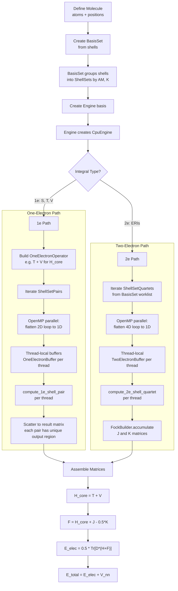
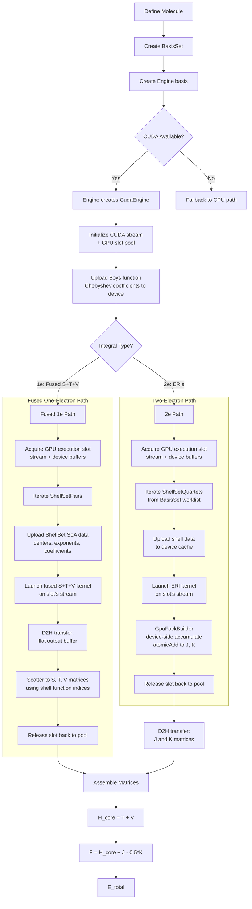
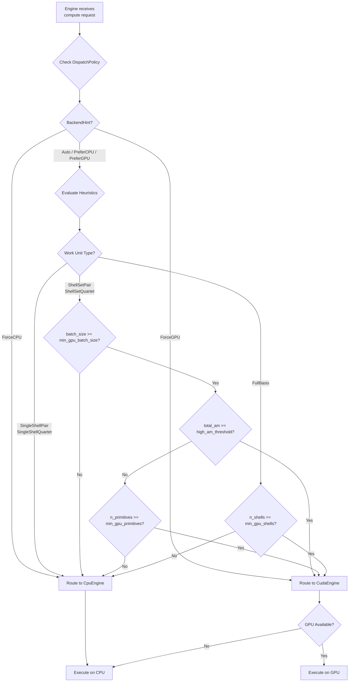
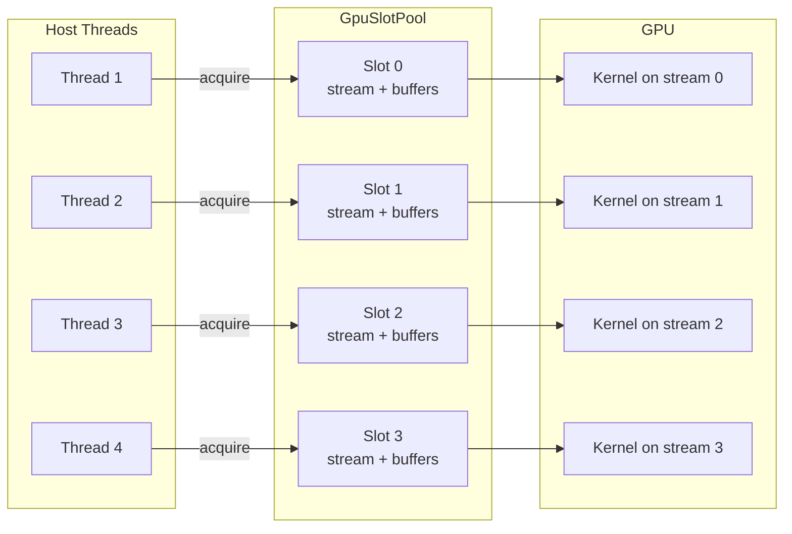

# LibAccInt Execution Flow

This document describes the execution flow for molecular integral computation
in LibAccInt, centered on the primary `Engine::compute(...)` /
`compute_and_consume(...)` API. It distinguishes host-side iteration over
ShellSet work units from the batched execution that happens inside each
ShellSetPair or ShellSetQuartet on CPU and GPU backends.

## 1. CPU-Only Execution Path

The CPU-only path is always available. The primary full-basis API uses
OpenMP-backed host parallelism when OpenMP is enabled, more than one thread is
configured, and the workload is large enough; explicit `_parallel` entry
points remain available for direct control.



### Key Implementation Details (CPU)

- **Primary 1e path**: `Engine::compute(OneElectronOperator, result)` now
  preserves ShellSetPair batching. On CPU it uses `compute_1e_parallel()` by
  default when host parallelism is available; otherwise it falls back to the
  sequential full-basis path.

- **1e parallel with reduction**: `CpuEngine::compute_1e_parallel_impl` uses
  thread-local result matrices (`std::vector<Real>` per thread) with manual
  reduction after the parallel region. This avoids atomic operations.

- **2e integrals**: `CpuEngine::compute_and_consume_parallel` flattens the
  4D shell quartet loop into 1D, uses `schedule(dynamic, 8)` for load
  balancing (quartet compute times vary with angular momentum), and
  thread-local `TwoElectronBuffer` objects.

---

## 2. GPU-Only Execution Path

The GPU path uses CUDA kernels for compute-intensive operations.



### Key Implementation Details (GPU)

- **GPU execution slots**: Each GPU compute call acquires a `GpuExecutionSlot`
  (via RAII `ScopedGpuSlot`) from the `CudaEngine`'s internal `GpuSlotPool`.
  Each slot bundles an independent CUDA stream, device output buffers, and host
  staging vectors. This enables multiple host threads to drive GPU work
  concurrently without data races or serialization. The pool size is
  configurable via `DispatchConfig::n_gpu_slots` (default: 4). When all slots
  are occupied, additional threads block until a slot is released.

- **Fused 1e kernel**: `CudaEngine::compute_all_1e_fused` acquires a single
  slot for the entire iteration, uploads shell set data once, and runs a
  single kernel that computes overlap, kinetic, and nuclear attraction
  integrals simultaneously on the slot's stream. The output buffer is laid
  out as `[S_flat | T_flat | V_flat]` and scattered to full matrices on the
  host.

- **ERI kernel dispatch**: The ERI kernel is dispatched per `ShellSetQuartet`.
  The host iterates ShellSetQuartets, but each launch computes the whole
  batched quartet rather than reducing it to one shell quartet at a time.
  Handwritten generic kernels handle all AM combinations in this alpha.

- **Device-side Fock accumulation**: `GpuFockBuilder` keeps J, K, and D
  matrices on the GPU. ERI batches are accumulated directly into J and K
  using `atomicAdd`, avoiding expensive D2H transfers per batch.

- **Memory management**: `ShellSetDeviceCache` manages persistent device
  allocations for shell data (thread-safe via internal mutex), reusing buffers
  across kernel launches and slots. Boys function coefficients (`d_boys_coeffs_`)
  are shared read-only across all slots.

---

## 3. CPU+GPU Hybrid Execution Path

The Engine's `DispatchPolicy` selects the backend per operation.



### Typical Hybrid Strategy

For small to medium molecules:
- **1e integrals (S, T, V)**: CPU or GPU depending on ShellSet batch size and primitive count
- **2e integrals (ERIs)**: GPU when a suitable single GPU is available; CPU otherwise

For large molecules:
- **All integrals**: GPU — both 1e and 2e benefit from GPU parallelism

### DispatchConfig Parameters

| Parameter | Default | Description |
|-----------|---------|-------------|
| `min_gpu_batch_size` | 16 | Minimum ShellSet batch for GPU dispatch |
| `min_gpu_primitives` | 1000 | Minimum total primitives for GPU |
| `high_am_threshold` | 4 | AM threshold favoring GPU (G functions and above) |
| `min_gpu_shells` | 10 | Minimum shells for full-basis GPU dispatch |
| `enable_auto_tuning` | false | Enable runtime auto-tuning |
| `auto_tune_min_batch` | 100 | Minimum batch for auto-tuning |
| `n_gpu_slots` | 4 | Number of concurrent GPU execution slots (streams + buffers) |

---

## 4. Concurrent GPU Execution

When multiple host threads call GPU-routed computations on the same Engine,
CudaEngine manages concurrency via a pool of **GPU execution slots**. Each
slot contains:

- A dedicated CUDA stream
- Private device output buffers (1e, 2e, fused)
- Host staging vectors for D2H transfers



**Slot lifecycle:**

1. Host thread enters `compute_batch()` or `compute_shell_set_*()` via the
   GPU path
2. A `ScopedGpuSlot` acquires an available slot from the pool (blocks if none
   free)
3. The kernel launches on the slot's CUDA stream using the slot's device
   buffers
4. Results are transferred back to the host
5. `ScopedGpuSlot` destructor releases the slot back to the pool

**Shared resources** (safe across slots):

- `ShellSetDeviceCache`: thread-safe via internal mutex; shell data uploaded
  once and reused by all slots
- `d_boys_coeffs_`: read-only coefficient table shared by all kernels
- `GpuFockBuilder`: has its own device buffers, independent of the slot pool

**Example: parallel batch computation**

```cpp
Engine engine(basis);
auto& quartets = basis.shell_set_quartets();
std::vector<IntegralBuffer> results(quartets.size());

// Each iteration acquires a GPU slot, launches a kernel, releases the slot
#pragma omp parallel for schedule(dynamic)
for (Size i = 0; i < quartets.size(); ++i) {
    results[i] = engine.compute_batch(
        Operator::coulomb(), quartets[i], BackendHint::ForceGPU);
}
```

---

## 5. CPU Parallelization Details

LibAccInt uses **OpenMP exclusively** for CPU parallelism. There is no MPI,
no `std::thread`, and no `std::async` in the codebase.

### OpenMP Parallel Regions

There are three main OpenMP parallel regions in the CPU engine:

#### Region 1: Sequential 1e (Flat Parallel)

**File**: `src/host/engine/cpu_engine.cpp` — `compute_1e_impl`

```
#pragma omp parallel
{
    OneElectronBuffer<0> local_buffer;       // thread-local buffer

    #pragma omp for schedule(static)
    for (Size idx = 0; idx < total_pairs; ++idx) {
        Size i = idx / n_shells_b;
        Size j = idx % n_shells_b;
        // compute and scatter — no races, unique output regions
    }
}
```

The 2D loop over shell pairs `(i, j)` is flattened to a 1D loop of length
`n_shells_a * n_shells_b`. Since each `(i, j)` pair writes to a unique
region of the output matrix (determined by `function_index`), no
synchronization or reduction is needed.

#### Region 2: Parallel 1e with Reduction

**File**: `src/host/engine/cpu_engine.cpp` — `compute_1e_parallel_impl`

```
vector<CacheLineAligned<vector<Real>>> local_results(n_threads);

#pragma omp parallel num_threads(actual_threads)
{
    auto& local_result = local_results[tid];
    OneElectronBuffer<0> local_buffer;

    #pragma omp for schedule(dynamic, 4)
    for (Size t = 0; t < n_tasks; ++t) {
        // compute into local_result
    }
}

// Manual reduction
for (auto& local : local_results) {
    for (Size i = 0; i < nbf * nbf; ++i) {
        result[i] += local.get()[i];
    }
}
```

Each thread maintains a private copy of the full result matrix. After the
parallel region, results are reduced (summed) sequentially. The
`CacheLineAligned` wrapper prevents false sharing between adjacent
thread-local vectors.

#### Region 3: Parallel 2e Compute-and-Consume

**File**: `src/host/engine/cpu_engine.cpp` — `compute_and_consume_parallel`

```
#pragma omp parallel num_threads(actual_threads)
{
    TwoElectronBuffer<0> local_buffer;

    #pragma omp for schedule(dynamic, 8)
    for (Size idx = 0; idx < total_quartets; ++idx) {
        // decode (i, j, k, l) from linear index
        // compute ERIs into local_buffer
        // consumer.accumulate(...)  — consumer must be thread-safe
    }
}
```

The 4D shell quartet loop is flattened to 1D. `schedule(dynamic, 8)` is
used because higher-AM quartets take significantly longer than lower-AM
ones, so dynamic scheduling provides better load balancing.

### ThreadConfig Class

The `ThreadConfig` class (`include/libaccint/engine/thread_config.hpp`)
provides a unified interface for thread count management:

```cpp
// Query
int hw = ThreadConfig::hardware_threads();     // hardware concurrency
int rec = ThreadConfig::recommended_threads(); // reads OMP_NUM_THREADS
bool omp = ThreadConfig::openmp_available();   // compiled with OpenMP?

// Configure
ThreadConfig::set_num_threads(4);  // set explicit count
ThreadConfig::reset();             // revert to auto-detection

// Resolve (0 = auto)
int actual = ThreadConfig::resolve(n_threads);
```

Python access:
```python
import libaccint as lai
print(lai.ThreadConfig.hardware_threads())
lai.ThreadConfig.set_num_threads(4)
```

### CacheLineAligned Wrapper

Thread-local data is wrapped in `CacheLineAligned<T>` (aligned to 64 bytes)
to prevent false sharing when thread-local vectors are stored contiguously:

```cpp
template<typename T>
struct alignas(CACHE_LINE_SIZE) CacheLineAligned {
    T value;
    // implicit conversions + get() accessor
};
```

### ScopedThreadCount RAII Guard

For temporary thread count changes:

```cpp
{
    ScopedThreadCount guard(2);  // set to 2 threads
    engine.compute_and_consume_parallel(op, fock);
}  // automatically restores previous thread count
```
